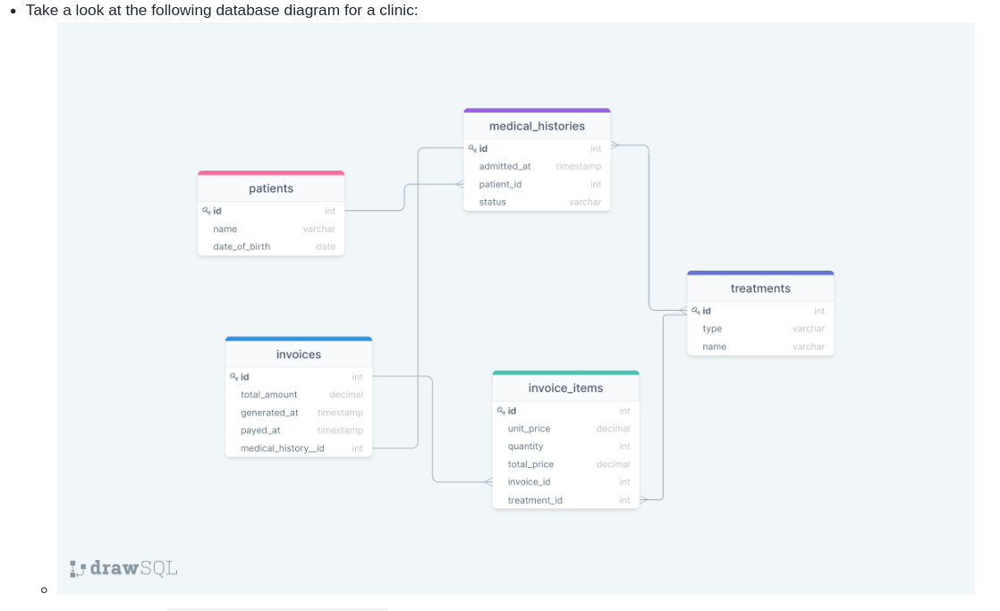

# diagram-to-database

In this project we have created database from diagram, and wrote required queries for it.

## Getting Started

This repository includes file with plain SQL that can be used to create a database:

- Use [queries](./schema_based_on_diagram.sql) to create all tables.

## ER DIAGRAM

## Authors

👤 **Megha Bodke**

- GitHub: [@megha-n-bodke](https://github.com/megha-n-bodke)
- LinkedIn: [Megha Bodke](https://www.linkedin.com/in/megha-bodke/)

**Bantelom Geto**

- GitHub: [@megha-n-bodke](https://github.com/megha-n-bodke)
- LinkedIn: [Megha Bodke](https://www.linkedin.com/in/megha-bodke/)

## 🤝 Contributing

Contributions, issues, and feature requests are welcome!

Feel free to check the [issues page](../../issues/).

## Show your support

Give a ⭐️ if you like this project!

## Acknowledgments

- Thanks to [Microverse](https://www.microverse.org/) for giving this opportunity to learn ...
- Code Reviewers & Coding Partners.
- Hat tip to anyone whose code was used.
- Inspiration.

## 📝 License

This project is [MIT](./MIT.md) licensed.
